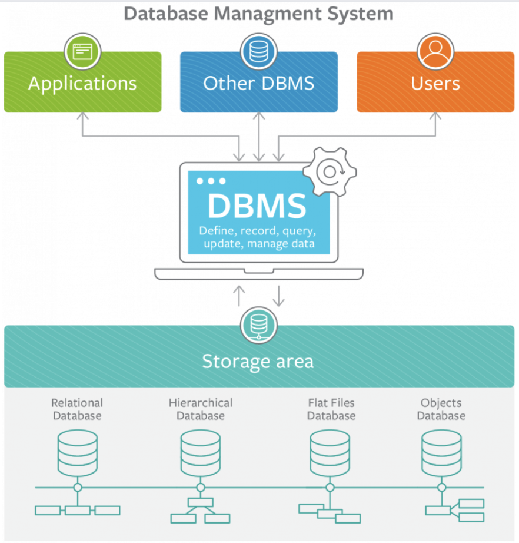

# Light SQL Engine with Distributed Parallel Buffer Pool

## Overview
This project involves the creation of a light SQL engine with a distributed Parallel Buffer Pool designed to manage 3,000 teamwork assignments at a college. The primary objective is to develop a scalable and efficient system capable of parallel query processing and distributed computing.

## Key Features
- **Distributed Parallel Buffer Pool**: Efficiently manages data storage and retrieval across multiple nodes, ensuring high availability and fault tolerance.
- **Scalable Query Execution Engine**: Supports parallel query processing, leveraging distributed computing to optimize performance.
- **Optimized Cache Replacement Policies**: Achieves O(1) time complexity using Linked Lists, Hash Tables, and B+ Tree Indexing for efficient data access and modification.

## Technical Implementation

### Database Management System (DBMS)
A Database Management System (DBMS) is a software system designed to store, retrieve, and manage data in databases. The DBMS serves as an interface between the end-user and the database, facilitating the creation, reading, updating, and deletion of data.

### Query Execution Engine
The Query Execution Engine is designed to execute SQL queries efficiently by leveraging parallel query processing and distributed computing. The engine breaks down complex queries into smaller sub-tasks, which are then processed concurrently across multiple nodes. This approach minimizes query execution time and optimizes resource utilization.

### Parallel Buffer Pool
The Parallel Buffer Pool is a critical component that manages data buffering and caching in a distributed environment. It ensures that frequently accessed data is readily available, reducing disk I/O operations and enhancing overall system performance. The buffer pool uses advanced cache replacement policies, including Linked Lists, Hash Tables, and B+ Tree Indexing, to achieve O(1) time complexity for data retrieval and updates.

## Design and Analysis of Algorithms (DAA)
The project involves the design and analysis of algorithms to solve complex problems efficiently. Key areas of focus include:
- **Algorithm Design**: Creating a sequence of steps to solve specific problems in the system.
- **Algorithm Analysis**: Evaluating the performance and efficiency of algorithms to ensure optimal resource utilization and minimal execution time.

### Compiler Design
The compiler design principles applied in this project provide an in-depth view of the translation and optimization process. Key aspects include:
- **Lexical Analysis**: Tokenizing the input SQL queries.
- **Syntax Analysis**: Parsing the tokens to generate a syntax tree.
- **Semantic Analysis**: Ensuring the semantic correctness of the queries.
- **Code Generation**: Converting the optimized queries into executable code.
- **Optimization**: Enhancing the performance of the generated code through various optimization techniques.

## Project Structure
Project Structure:

- src/
  - buffer_pool/
    - buffer_pool.cpp
    - buffer_pool.h
  - query_execution/
    - query_executor.cpp
    - query_executor.h
  - algorithms/
    - cache_replacement.cpp
    - cache_replacement.h
  - compiler/
    - lexer.cpp
    - parser.cpp
    - semantic_analyzer.cpp
    - code_generator.cpp
  - main.cpp
- include/
  - buffer_pool.h
  - query_executor.h
  - cache_replacement.h
- docs/
  - DBMS/
    - database-management.png
  - DAA/
    - 884_medium.png
  - Compiler-Design/
    - download.png
- README.txt

## Installation and Usage
1. Clone the repository:
   git clone https://github.com/your-repo/light-sql-engine.git

2. Navigate to the project directory:
   cd light-sql-engine

3. Build the project:
   make all

4. Run the SQL engine:
   ./bin/sql_engine
